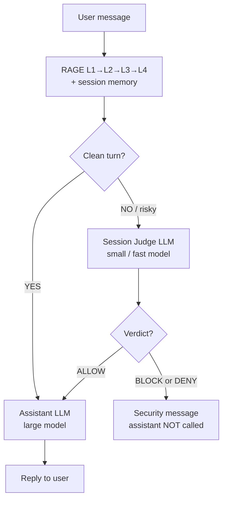

# RAGE + Session Judge — simple flowchart

Visual diagram: `figures/rage_judge_flow.png`

## Mermaid (copy to GitHub / Notion)



## In plain English

1. **Every turn** goes through **RAGE** (regex, threat KB, semantic drift, decision score).
2. If the turn looks **clean**, the **assistant** answers immediately — the judge is **skipped** (faster, cheaper).
3. If RAGE flags **risk**, the **judge** reviews:
   - company bot profile (what is allowed / forbidden),
   - full conversation history,
   - RAGE briefing (L1/L2/L3 scores, drift, session risk).
4. **ALLOW** → assistant runs anyway (RAGE was too cautious).
5. **BLOCK / DENY** → user sees a security message; the assistant never sees the attack.

## Regenerate PNG

```bash
uv run python scripts/generate_judge_flowchart.py
```

## Code reference

`rage_core/gate/chat_gate.py` — `ChatGate.evaluate()`
