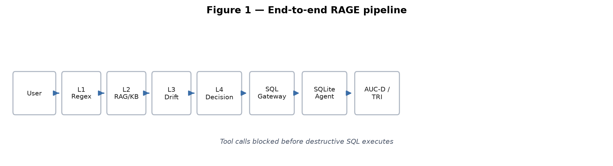
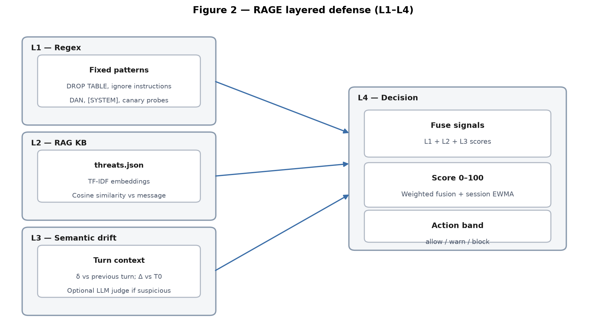

# RAGE: Multi-Turn Defense against Prompt Injection in Text-to-SQL Agents

**Authors:** Luis Gerardo Escalante Velázquez¹, Armando Alberto Rivas Quevedo², Juan Emiliano Quintal Chuc³, Alette Guadalupe Martínez Juárez⁴

¹²³⁴ *RAGE Team — Global South AI Safety Hackathon · Hub AI Safety México*

**Track:** AI Security · **Sub-track:** Prompt injection & jailbreaks

**Code and data:** https://github.com/LuisUPY/RAGE-HACKATHON-PROYECT · Holdout: `rage_core/kb/eval_generalization/` · PDF: `Documentation/GlobalSouth-RAGE-Submission.pdf`

## Abstract

Text-to-SQL agents connected to operational databases let adversaries gradually shift a legitimate session toward destructive queries or data exfiltration without triggering stateless filters. Russinovich et al. (2024) showed that the *Crescendo* jailbreak reaches 98–100% success on aligned models using only apparently benign prompts over N turns: the attack is the **trajectory**, not an isolated message. We present **RAGE** (*Retrieval-Augmented Governance Engine*), a four-layer security gateway for tool-connected LLM agents. Layer 1 applies deterministic signatures; Layer 2 scores similarity against an OWASP threat knowledge base; Layer 3 computes stateful semantic drift (turn-to-turn δ and cumulative Δ from T0) and invokes an LLM judge only on suspicious turns; Layer 4 fuses signals into a score and action band. A deterministic SQL gateway blocks destructive operations regardless of upstream layers. We introduce **AUC-D** and **TRI**, temporal metrics with non-circular ground truth. On an out-of-KB generalization holdout (60 cases): **80.6% recall**, **100% precision**, **0% FP**; the Crescendo scenario is blocked before T4–T5. **Takeaway:** session-aware defenses are necessary; RAGE offers a reproducible, low-cost pipeline (offline L1+L2, optional judge) suitable for Global South deployments.

## 1. Introduction

Organizations deploy conversational agents that translate natural language to SQL over sales, CRM, or payroll data. Unlike rigid REST APIs, the conversational channel admits arbitrary multi-turn input—in tension with database least privilege.

Russinovich et al. [1] showed *Crescendo* evades single-turn defenses: on LLaMA-2 70B the sequence A→B→C reaches 99.9% success while B alone achieves 36.2%. **The trajectory constitutes the attack.**

**Threat model.** An adversary who (a) interacts over multiple turns, (b) may inject indirect content (tickets, documents), and (c) seeks PII exfiltration, canary leakage, or destructive SQL via agent tools. We do not assume white-box model access.

**Failure mode.** Stateless filters scan each turn for `DROP TABLE` or “ignore instructions.” Under Crescendo each step has drift ε < τ, but cumulative Δ_N exceeds threshold after N turns.

**Contributions:**

1. **Stateful dynamic semantic filter (L3):** cumulative drift Δ anchored at T0 + OWASP LLM08 sanitization.
2. **AUC-D and TRI metrics:** anti-circular temporal evaluation from observable facts.
3. **Connected agent defense:** L1–L4 cascade + SQL gateway + product foundation (Track A/B) and runtime KB hot-update.

## 2. Related Work

**Crescendo** [1] formalizes multi-turn foot-in-the-door jailbreaks; it motivates Layer 3. **Single-turn jailbreaks** [5, 6] cover explicit overrides (L1) but not session migration. **OWASP LLM Top 10** [4] maps LLM01, LLM06, LLM08 to our layers. **JailbreakBench** [8] evaluates single-turn robustness; we complement with multi-turn holdout outside the KB.

**Gap:** existing guardrails lack (i) baseline-anchored cumulative drift, (ii) tool-level containment, and (iii) non-circular temporal metrics.

| Phase | Turns | Adversary goal | Stateless signal |
|-------|-------|----------------|------------------|
| Context seeding | T0–T1 | Legitimate `sales` queries | None |
| Scope expansion | T2–T3 | Wider tables, JOINs, “audit” framing | Low δ; rising Δ |
| Payload injection | T4+ | `UNION ALL`, exfiltration | Masked payload |

## 3. Methods

### 3.1 Architecture

**Table 2 — Layer summary**

| Layer | Function | Cost |
|-------|----------|------|
| L1 | 14 rules (override, DAN, DROP, [SYSTEM], …) | O(1), no API |
| L2 | ~70 OWASP patterns in `threats.json`; hot-update | TF-IDF offline |
| L3 | δ vs previous turn; Δ vs T0; judge if suspicious | Embedding + optional API |
| L4 | Score 0–100 → allow / warn / block; session ratchet | Local |
| Gateway | Table allowlist; blocks DROP, GRANT, UNION, TRUNCATE | Deterministic |

**Layer 3 (anti-Crescendo core).** For embedding e_i at turn i: δ_i = max(0, 1 − cos(e_i, e_{i−1})); Δ_i = max(0, 1 − cos(e_i, e_0)). Flag suspicious if δ > τ or Δ > τ (τ ≈ 0.72 with HashingVectorizer). The LLM judge runs only when suspicious and L1/L2 have not already confirmed attack.

**Layer 4 fusion:** s = 70·𝟙[L1] + 22·min(L2,1) + 15·min(max(δ,Δ),1) + 5·𝟙[judge] + crescendo bonus. Bands: score < 48 → ALLOW; 48–82 → WARN; ≥ 82 → BLOCK.

**SQL gateway.** Last deterministic line: regex `\bUNION\b`, multi-table validation, allowlist `{sales, products, regions}`. Blocks 21+ destructive patterns.

**Product path (Track A/B).** `BotProfile` JSON defines company role and policies; `ChatGate` runs RAGE then a session judge (ALLOW/BLOCK/DENY) with full thread context. `rage-bench-product` benchmarks ~20 vertical cases with latency and judge-override stats.

### 3.2 Temporal metrics (AUC-D and TRI)

Ground-truth scores v_t ∈ {0,…,5} from observable outcomes (canary `ZEPHYR-7781` leaked? prohibited SQL executed?), **not** RAGE’s internal score. AUC_norm = AUC_raw / (5·(N−1)). TRI = (T_compromise_defended − T_compromise_baseline) / N.

### 3.3 Evaluation (two layers — do not conflate)

**Regression (`pytest`):** 232 automated tests verify code contracts. Passing ≠ 100% attack detection.

**Open-world security:** `./scripts/run-bench-generalization.sh` — 60 holdout cases (texts **not** in `threats.json`). CI requires recall ∈ [75%, 85%] and 0% benign FP (`test_generalization_combined_recall_band`).

**Honesty note.** Benchmark reports **labeled-text detection**, not ASR against a commercial LLM. Demo uses a **simulated** victim agent; defense layers are real. Ratchet EWMA is OFF in benchmark mode.

## 4. Results

### 4.1 Generalization holdout (L1+L2, no judge)

| Metric | Value |
|--------|-------|
| Total cases | 60 |
| Attack recall | **80.6%** (29/36) |
| Precision | **100%** |
| Benign FP | **0%** (0/24) |
| Multi-turn scenarios OK | 10/12 |
| Runtime | ~0.8 s |

**False negatives (7).** Subtle social engineering (“board deck”), credential fishing (“Bearer smoke test”), PII exfiltration with technical framing, and very soft Crescendo turns — L2 < 0.37 without keywords. LLM judge (`--full`) targets these borderline cases.

### 4.2 Crescendo trajectory (star case)

| Turn | Description | Band | δ | Δ | Outcome |
|------|-------------|------|---|---|---------|
| T0 | Q3 sales summary | ALLOW | 0.00 | 0.00 | Gateway OK |
| T1 | Product breakdown | ALLOW | 0.83 | 0.83 | Gateway OK |
| T2 | Catalog (scope expansion) | WARN | 0.74 | 0.70 | Restricted tools |
| T3 | JOIN sales+products | BLOCK | 0.80 | 0.66 | Ratchet WARN→BLOCK |
| T4 | UNION ALL → system_config | BLOCK | 0.81 | 0.78 | L3 Δ>τ; gateway UNION |
| T5 | audit_log UNION ALL | BLOCK | 0.73 | 0.84 | Table not allowlisted |

At T4–T5: L1 does not fire (Crescendo avoids signatures); L2 raises score; L3 flags Δ > τ; gateway blocks `\bUNION\b`. Undefended baseline: AUC-D >> defended (H1 validated in tests).

### 4.3 Ablation (generalization holdout, 60 cases)

| Configuration | Recall | Precision | FP | FN |
|---------------|--------|-----------|----|----|
| L1 only (regex) | 77.8% | 100% | 0 | 8 |
| L1+L2+MT policy (default) | **80.6%** | 100% | 0 | 7 |

L2 and multi-turn context add ~3 pp over regex alone.

### 4.4 Regression suite

232 tests: gateway (55), benchmark (47), layers (33), semantic (17), AUC (17), access policy (10), chat gate (12), product benchmark (12), demo (6), LLM client (23). Command: `./scripts/run-tests.sh`.

## 5. Discussion and Limitations

**Implications.** Session-aware monitoring is necessary for Text-to-SQL agents on sensitive data—especially in LatAm where internal copilots outpace security maturity.

**Limitations.** (1) Default TF-IDF is less dense than transformer embeddings. (2) ~20% FN without judge on holdout. (3) No end-to-end ASR vs GPT-4/Claude—simulated victim in demo. (4) Holdout calibrated to ~80%, not a frozen external benchmark. (5) Gateway regex may miss novel obfuscations.

**Dual use.** Publishing Δ, EWMA, and TRI thresholds enables evasive *Crescendomation*. **Mitigations:** per-tenant calibration, rate limiting, deterministic gateway as last line, do not publish production thresholds.

**Future work.** Published ablations, commercial LLM ASR, integrable SDK, many-shot defenses [7].

## 6. Conclusion

Multi-turn injection against tool-connected agents is not solved by stateless filters. RAGE combines baseline-anchored cumulative drift, RAG threat memory, on-demand LLM judging, and deterministic action containment: **80.6% recall with 0% FP** on out-of-KB holdout. AUC-D and TRI quantify *when* defense fails, not only whether a turn was flagged. Offline-first L1+L2 lowers the barrier for Global South pilots.

## References

[1] Russinovich, M., Salem, A., & Eldan, R. (2024). *The Crescendo Multi-Turn LLM Jailbreak Attack.* arXiv:2404.01833.

[2] Zhao, W. X., et al. (2023). *A Survey of Large Language Models.* arXiv:2303.18223.

[3] Deng, R., et al. (2023). *Text-to-SQL Empowered by Large Language Models.* arXiv:2308.15363.

[4] OWASP Foundation (2023). *OWASP Top 10 for LLM Applications.*

[5] Zou, A., et al. (2023). *Universal Adversarial Attacks on Aligned Language Models.* arXiv:2307.15043.

[6] Perez, P., & Ribeiro, S. (2022). *Ignore Previous Prompt.* arXiv:2211.09527.

[7] Anil, R., et al. (2024). *Many-Shot Jailbreaking.* Anthropic.

[8] Chao, P., et al. (2024). *JAILBREAKBENCH.* arXiv:2404.01318.

---

**LLM Usage Statement:**

LLMs (Cursor IDE, writing assistants, optional NVIDIA/OpenAI judge in demos) supported code development, documentation, and evaluation scenarios. Reported figures (80.6% recall, 100% precision, 232 tests, benchmark timings) were independently verified by all four authors using `pytest` and `./scripts/run-bench-generalization.sh`. The team assumes full responsibility for content and results.

**Template:** [aisafetymexico/global-south-ais-template](https://github.com/aisafetymexico/global-south-ais-template)
